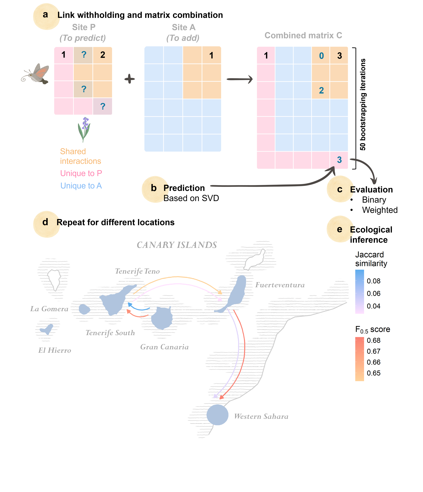

# :wave: About
This repository contains the code and data for the paper: "Predicting ecological interactions across space through pairwise integration of latent network patterns".

# :page_facing_up: Paper and citing
Kesem Abramov, Geut Galai, Barry Biton, Rami Puzis, and Shai Pilosof (2026). **Predicting ecological interactions across space through pairwise integration of latent network patterns**. *Methods in Ecology and Evolution,* 00, 1–16. doi: <https://doi.org/10.1111/2041-210x.70357>

# Abstract:
1. Ecological communities are complex and exhibit considerable spatial variability, presenting challenges in accurately understanding these systems. A primary obstacle in ecological research is the existence of 'missing links' between species: inevitable unobserved interactions that limit our comprehension of ecological networks and their response to change. While link prediction methods have been developed to address this challenge, most approaches overlook the intrinsic spatial variability of ecological systems.
2. We introduce a flexible, spatially explicit framework based on matrix decomposition that leverages latent structural patterns to predict missing interactions and their strength, without requiring species traits or environmental data. The framework integrates information from paired auxiliary and target networks (locations) using thresholded SVD for link prediction. We applied it to plant–pollinator networks across the Canary Islands, performing pairwise predictions between locations, comparing them to within-location predictions (as a control), and quantifying how spatial variability influences predictive performance.
3. Predictions revealed that latent network structure contains substantial predictive information, with F0.5 scores consistently exceeding a random baseline (mean F0.5 = 0.67 ± 0.02 SD), while being less sensitive to interaction strength. The method enabled identifying plausible gaps in the data and producing ecologically coherent predictions. Incorporating information from auxiliary locations enhanced predictive accuracy in certain cases, but success depended on spatial context: predictions were most reliable when derived from nearby, ecologically similar locations, and declined with increasing geographic and ecological distance, consistent with a distance-decay effect.
4. We conclude that the predictability of missing links is spatially variable, reflecting both network and species-level heterogeneity. These patterns provide insights into network structure and the ecological processes shaping it, complementing trait-based approaches. While network structure offers rich predictive information, spatial context is essential for applying it effectively: ignoring spatial variability can obscure ecological signals and inflate predictive error. Our framework is computationally efficient, transferable, and readily applicable to any system with spatial or temporal replication. It can be used for a variety of ecological contexts, including island systems, fragmented landscapes, and environmental gradients, making it a practical and scalable tool for advancing link prediction in ecology.

# :computer: Code:
Instructions for running the code and reproducing the results are in the repository Wiki under ["Code"](https://github.com/Ecological-Complexity-Lab/spatial_prediction/wiki/Code).

# :file_cabinet: Data:
Detailed in the repository Wiki under ["Data"](https://github.com/Ecological-Complexity-Lab/spatial_prediction/wiki/Data).
